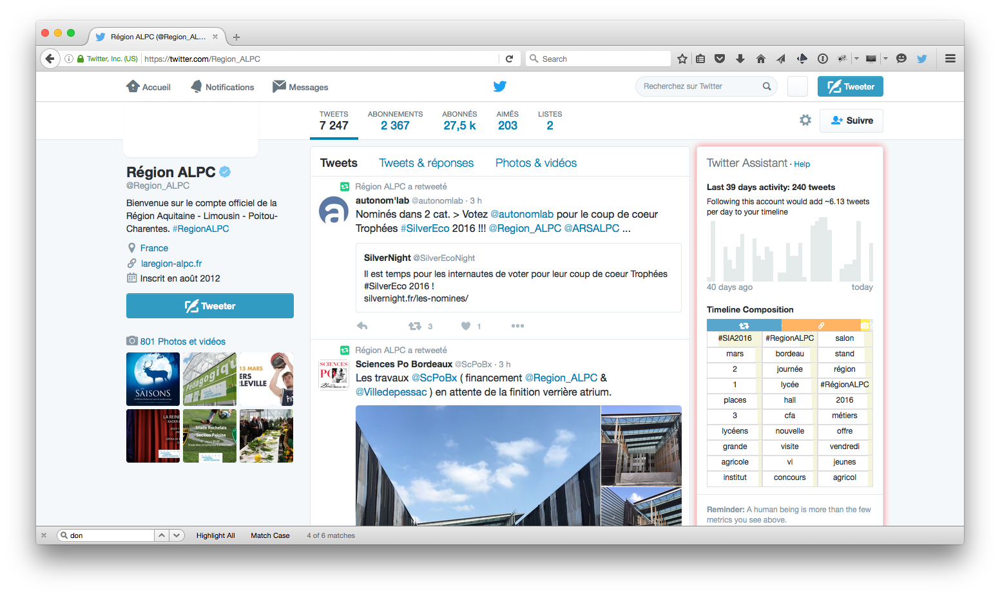

Twitter Assistant
==============

Twitter Assistant is an addon for Firefox aiming at improving the Twitter web experience.
Among other things, it provides insights about Twitter users when you're visiting their profile page.




## Features

* Seamless integration to the Twitter UI
* A couple of metrics (% of tweets with links over the last 200 tweets for instance)
* No strings attached


## How it works

* Install the addon
* Create a Twitter app
* Feed the addon with the Twitter app credentials (API key and API secret)
* That's it! ... well... go to someone's Twitter profile page to see insights about how this person uses Twitter :-)


## No strings attached

There are lots of services around the Twitter API. The vast majorty of them are controlled by third-parties. Too often, this dependency is unnecessary. Possible consequences of this dependency are that the third-party can suddenly disappear (like a company going out of business or changing focus) or change its conditions anytime (like demand money or rise its prices) and the service can become unavailable or is cannot be relied on in the long run.

Twitter Assistant, on the other hand, is specifically designed to prevent any such third-party dependency. With Twitter Assistant, you create a Twitter app (which Twitter initially intended for developers, but which anybody can do) and the addon only takes advantage of what the API gives access to.
By design, there is no server-side component, no third-party dependency. Once the addon is installed and fed with valid credentials, it should keep working pretty much forever (modulo some risks, see below). The source code is MIT licenced for the very purpose of being easily forkable if become necessary.


## Limitations

Twitter Assistant takes advantage of a Twitter app credentials you create. As such, it is subject to the API rate limits. Note that these should be rarely hit. Worst case scenario, the addon stops working for 15 minutes (time window before the API rate limit resets).


## Risks

* The addon integrate with the Twitter web UI. As such, if the UI comes to change, the addon may break. This is mitigated by displaying the Twitter Assistant on the top-right corner if no better place is found.

* The Twitter API authentication schema may change over time. A developer will need to update the code. All the code interacting with the API is fairly isolated, so this change should be fairly easy.

* The Firefox addon API may change over time. A developer will need to update the code. No stupid risk has been taken while writing the code, it's all standard HTML, CSS, JS, so as long as the addon API changes are well documented, the evolution should be fairly easy.


# Contributing

* Install the [addon SDK](https://developer.mozilla.org/en-US/Add-ons/SDK/Tutorials/Installation) including [jpm](https://developer.mozilla.org/en-US/Add-ons/SDK/Tools/jpm).

* Create a Twitter app
* Create a `prefs.json` file based on the template and fill in the key and secret with your app's


* Install [Node.js](http://nodejs.org/)

```bash
git clone git@github.com:DavidBruant/Twitter-Assistant.git
cd Twitter-Assistant
npm install

npm run compile
npm run build
npm run run
```

compile is to compile everything in TypeScript
build is to browserify content-side

`build` (using `tsify`) has this problem that if there are compilation errors, it'll only show the first one. So run `compile` before `build`


## Daily routine

```
npm run watch
npm run compile
```

### server

Needs Node.js v5+

````
npm i forever -g
npm run compile
forever start server/index.js
````


# Acknowledgements

Thanks to [@clochix](https://twitter.com/clochix), [@davidbgk](https://twitter.com/davidbgk/), [@oncletom](https://twitter.com/oncletom) and a couple of others for the inspiration to make this addon an emancipating purely client-side piece of software.

Thanks to [@glovesmore](https://twitter.com/glovesmore) for learning HTML/CSS/JS :-)

Thanks to [@Twikito](https://twitter.com/Twikito) for the amazing visuals, UI and UX work I wouldn't have been able to do.

Thanks to [@pascalc](https://twitter.com/pascalchevrel), [@guillaumemasson](https://twitter.com/guillaumemasson), **Yannick Gaultier** and all of those who contributed ideas, thoughts, shared feedback about this addon

Thanks to [@amarlakel](https://twitter.com/amarlakel) for making me understand that there is more to social networks than what we do with them.

Thanks to the [Aquitaine-Limousin-Poitou-Charentes region](http://laregion-alpc.fr/) for [awarding a 10,000€ grant](http://numerique.aquitaine.fr/Laureats-de-l-appel-a-projets-2014) to support the project at the occasion of the "appel à projet « Usages innovants des données numériques : partage, exploitation et valorisation »".

.

This grant is being shared among David Bruant (5,000€) and Matthieu Bué (5,000€) to get the project to a robust, easy-to-use, well-designed and featurefull 1.0 version.


# License

MIT
